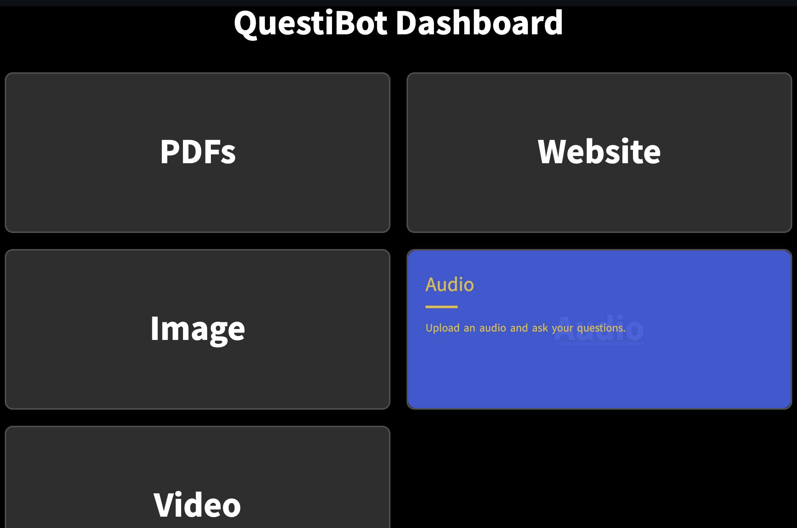
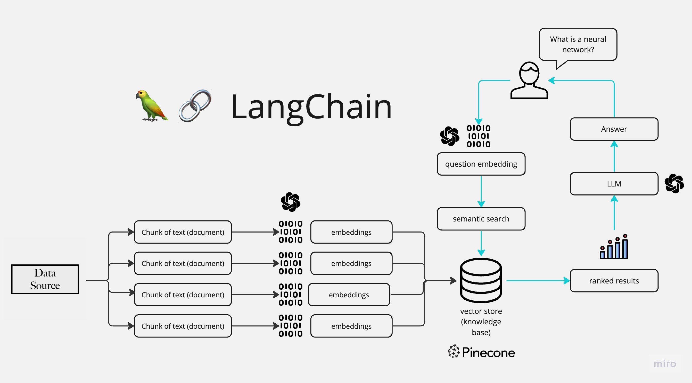

# QuestiBot_Project
## Introduction
------------
The QuestiBot has been build using Python application that allows users to chat with their own data. Users can ask questions about the data using natural language, and the application will provide relevant responses based on the content of the data. This app utilizes a language model to generate accurate answers to users queries. Please note that the app will only respond to questions related to your own loaded data.

This is Generative AI FAQ Chatbot Project. You will find following five modules:
1. QA_on_PDF
2. QA_on_Web
3. QA_on_Image
4. QA_on_Audio
5. QA_on_Video

## UI Diagram


## Technical Diagram



## How It Works (Technical Details)
------------

The application follows these steps to provide responses to your questions:

1. Data Loading: The app reads uploaded data and extracts their text content.

2. Text Chunking: The extracted text is divided into smaller chunks that can be processed effectively.

3. Language Model: The application utilizes a language model to generate vector representations (embeddings) of the text chunks.

4. Similarity Matching: When you ask a question, the app compares it with the text chunks and identifies the most semantically similar ones.

5. Response Generation: The selected chunks are passed to the language model, which generates a response based on the relevant content of the uploaded data.


## Dependencies and Installation
----------------------------
To install the MultiPDF Chat App, please follow these steps:

1. Clone the repository to your local machine.

2. Install the required dependencies by running the following command:
   ```
   pip install -r requirements.txt
   ```

3. Obtain an API key from OpenAI and add it to the `.env` file in the project directory.

## Usage
-----
To use the QuestiBoat GenAI ChatBot, follow these steps:

1. Ensure that you have installed the required dependencies and added the OpenAI API key to the `.env` file.
2. Navigate to project folder using following command:
   ```
   cd folder_location/GenAI_Chatbot
   ```
3. Run the `Dashboard.py` file using the Streamlit CLI. Execute the following command:
   ```
   streamlit run Dashboard.py
   ```

4. The application will launch in your default web browser, displaying the user interface.

5. Select your module as per your data format (like .pdf, .jpg, .wav or web link)

6. Upload or paste your link (as per you module) into the chatbot.

7. Click on process and wait for processing to complete.

8. Ask questions in natural language about the loaded data using the chat interface.


## License
-------
The QuestiBoat GenAI ChatBot is released under the [MIT License](https://opensource.org/licenses/MIT).
